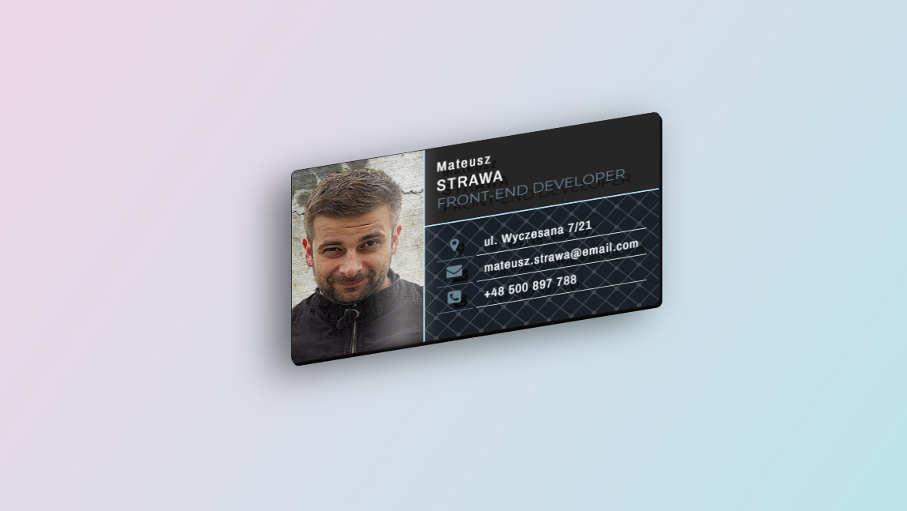

# 3D_business_card
3D business card design, created in HTML and CSS - css exercises.

<small><b>CSS</b> <b>transform</b>, <b>CSS rotate</b>, <b>CSS 3D</b>, <b>translateZ</b>, <b>preserve-3d</b>, <b>transform-style</b>, <b>transform-origin</b></small>

Demo: <a target="demo" href="http://mateuszstrawa.pl/stuff/wizytowka3d/">demo</a>

